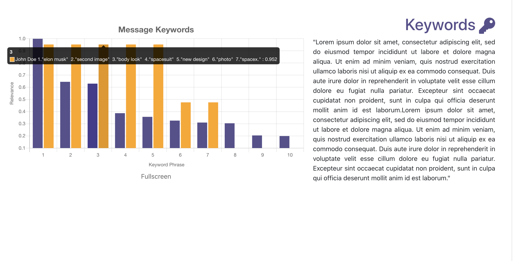

# **Telehistory**
Telehistory is a ReactJS pet project that utilizes ChartJS and MonkeyLearn API to deliver you data representation of your Telegram Chat History. 
Live Link (Sample Data): https://acui51.github.io/telehistory/

## **Analyze Your Own Chats:**

1. Clone the repo
2. Obtain your own MonkeyLearn API key from https://monkeylearn.com/
3. Navigate to `src/mock/insert_api.js` and paste in your API key between the quotes.
4. Export Telegram Chat History into a JSON file and place that in the `src/data` folder.
5. Navigate to `src/containers/ChartBuilder.js` and change `import data from "../../data/sample.json";` to `import data from "../../data/<YOUR JSON FILE>.json";`
6. Load the React app with `npm install` `npm start`

## Landing Page:

## Frequency Analysis:

## Keyword Extraction:

## Sentiment Analysis:

